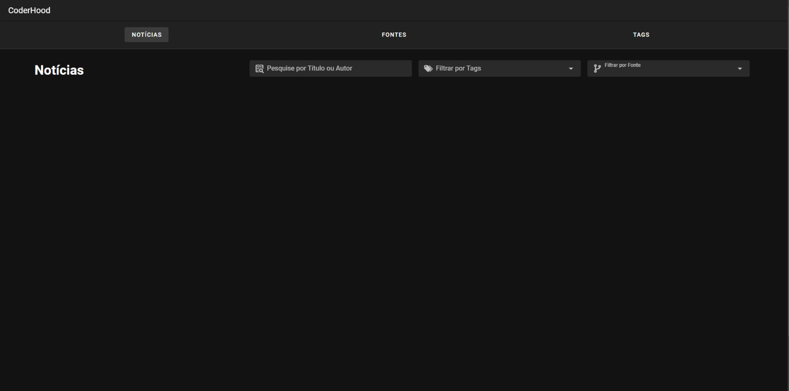

# 
 Funcionamento da aplicação  

## Detalhamento da aplicação GSW_API

-Este manual visa auxiliar os usuários na utilização da aplicação GSW_API.

## 1. Tela Inicial  

A imagem abaixo é a tela de início da aplicação, contendo três abas:  

- Visualização das notícias
- Cadastro de Fontes
- Cadastro de Tags
  

## 2. Cadastrar Fontes  

### 2.1. Clique em "Fontes" e no símbolo de "+" para adicionar uma fonte  

  

### 2.2. Selecione o tipo de fonte  
- API ou Portal para abrir as configurações específicas de cada tipo
    
  

## Ao selecionar Portal  
- Preencha as informações solicitadas como demonstrado na imagem abaixo

  

## Ao selecionar API  
- Preencha as informações solicitadas como demonstrado na imagem abaixo
  

## 3. Cadastrar Tags  

### 3.1. Clique em "TAGS" insira um nome e se necessário sinônimos e clique em salvar  

## 4. Gerenciar Tags Cadastradas  

### 4.1. Clique no icone do lápis para editar uma Tag  
- Edição do nome, sinônimos e possibilidade de atrubuir uma cor para a tag

- Atribuindo uma cor a tag
  

  

### 4.2. Clique no icone de lixeira para excluir uma Tag  

  

- Confirme a exclusão
  
  

- Tag excluida

  

  

## 5. Página de Notícias Salvas  
- Página de notícias e seus filtros disponíveis

  

### 5.1 Vincular manualmente a tag a noticia  

  

- notícia com tag vinculada

  

## - Pesquisa por Título ou Autor

  

## - Pesquisa por Tag  

    
