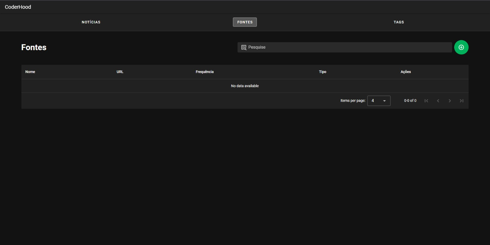
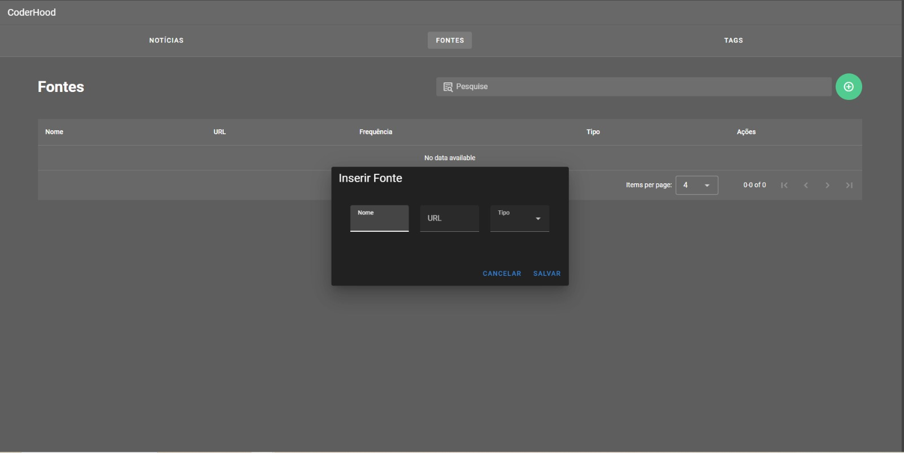
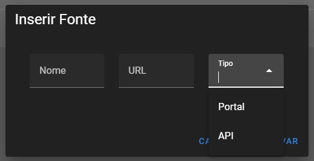
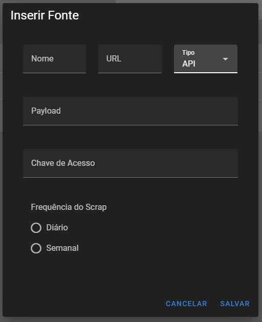

### Após seguir as etapas de manual de instalação e manual rodar programa, você pode rodar o programa GSW_API.

## EXPLICANDO CADA PARTE da aplicação GSW_API

1.Tela Inial, terá três opções:

- Cadastro de Portais de Notícias/APIs   
- Cadastro de Tags
- Cadastro de Fontes

2.Cadastro de Fontes

2.1 Clique em fontes

2.2 Clique no simbolo de "+" para adicionar uma fonte

2.3 Preencha os campos com os dados da fonte, escolhendo entre API ou Portal

2.4 Escolher o tempo de Scraping e a frequência de atualização e parâmetros e depois clica em salvar

2.5 Cadastro da api, mesmo padrão, escolha a fonte e clique em salvar

