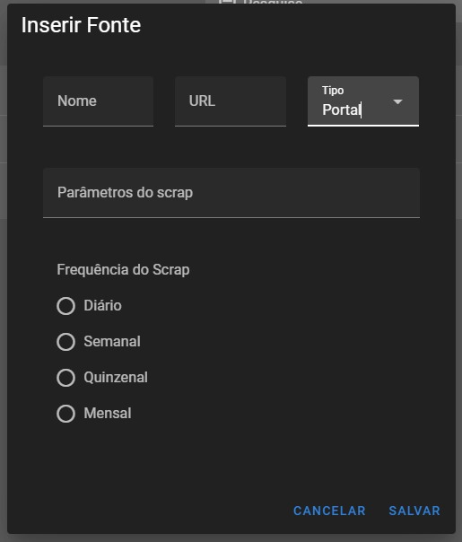

### Após seguir as etapas do manual de instalação e do manual de execução, você pode rodar o programa GSW_API.

## Explicando Cada Parte da Aplicação GSW_API

1. **Tela Inicial**: Terá três opções:
    - Cadastro de Portais de Notícias/APIs
    - Cadastro de Tags
    - Cadastro de Fontes

    

2. **Cadastro de Fontes**

    2.1. Clique em "Fontes"
    
    

    2.2. Clique no símbolo de "+" para adicionar uma fonte
    
    

    2.3. Preencha os campos com os dados da fonte, escolhendo entre API ou Portal
    
    

    2.4. Escolha o tempo de scraping, a frequência de atualização e os parâmetros, depois clique em "Salvar"
    
    

    2.5. Cadastro da API: siga o mesmo padrão, escolha a fonte e clique em "Salvar"
    
    

3. **Gerenciar as Tags Cadastradas**
    
    

4. **Gerenciar Página de Notícias Salvas**
    
    

    4.1. Renomear, excluir e editar notícias e APIs
    
    
