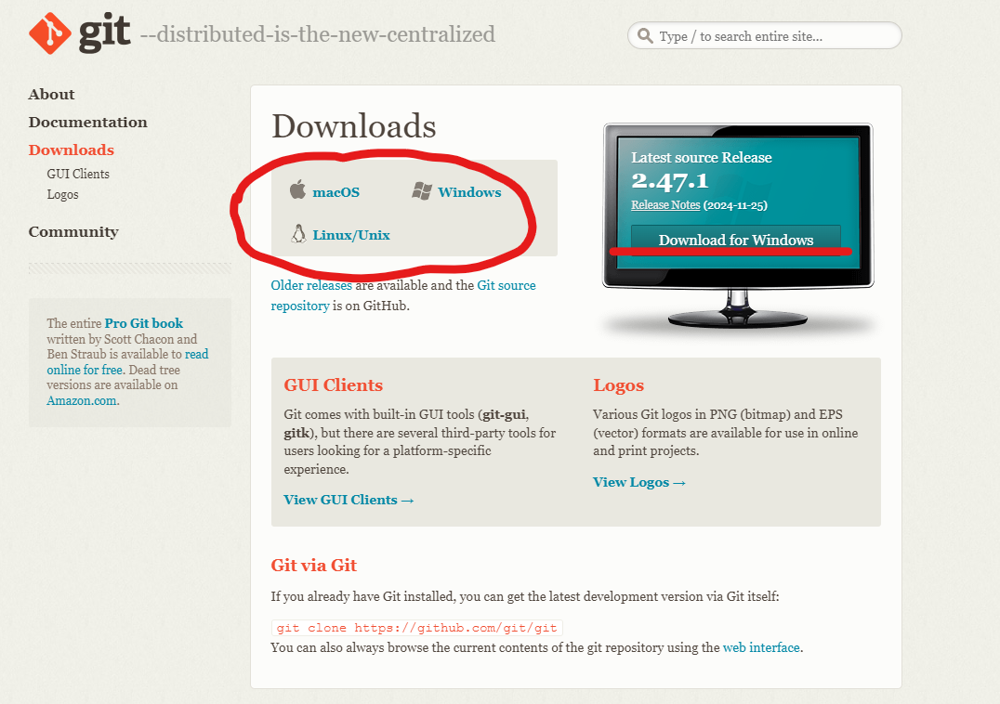
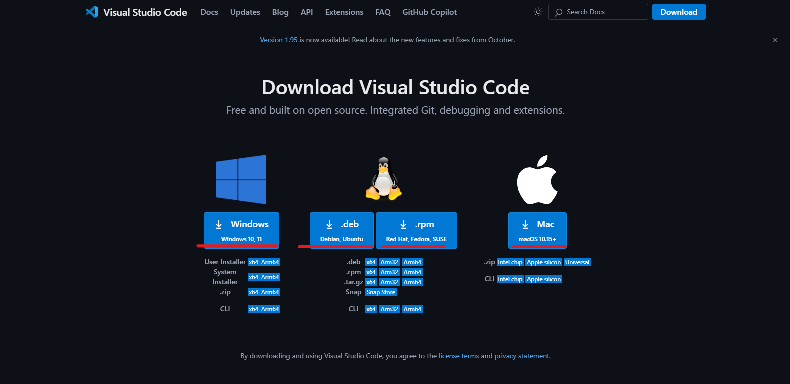
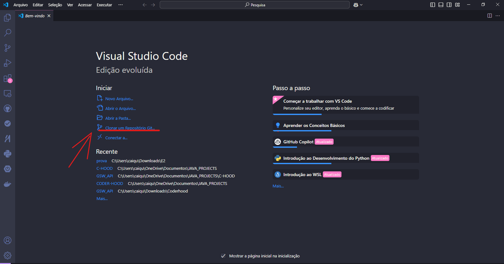
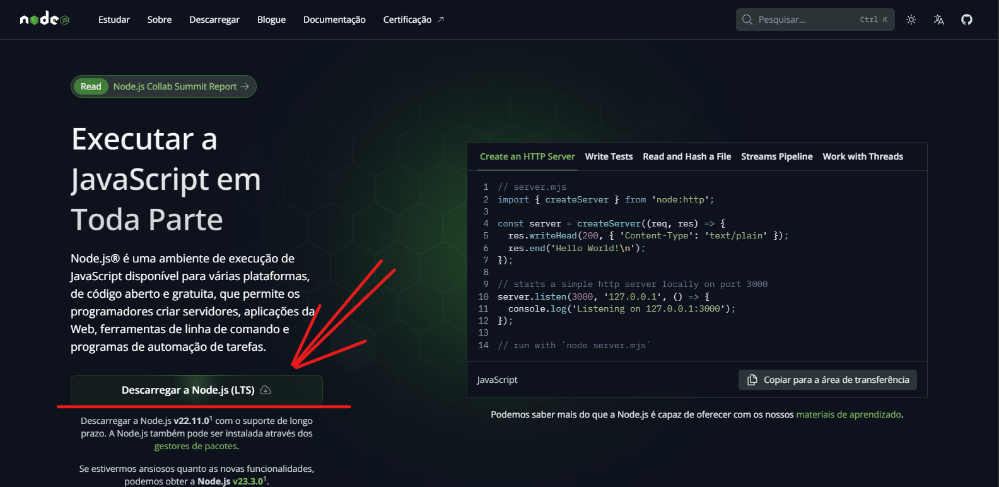
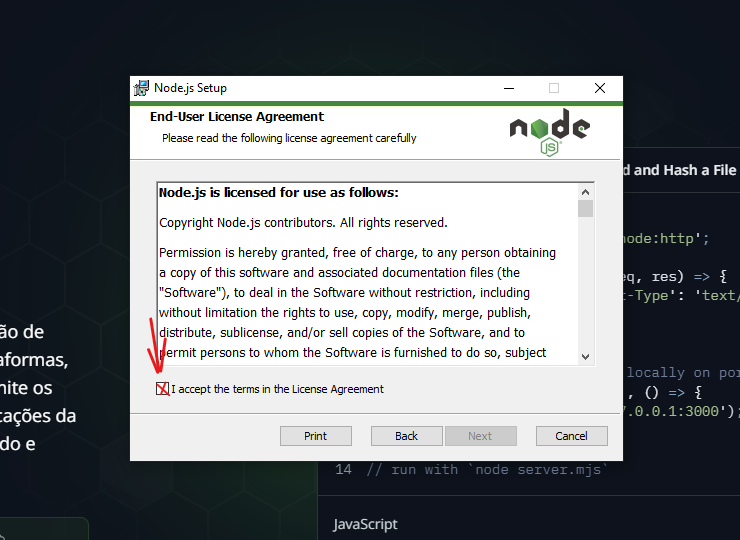
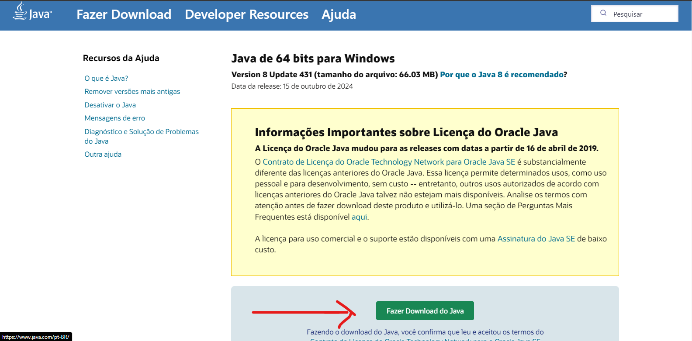
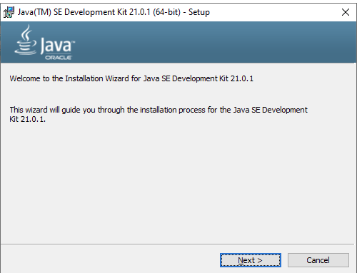
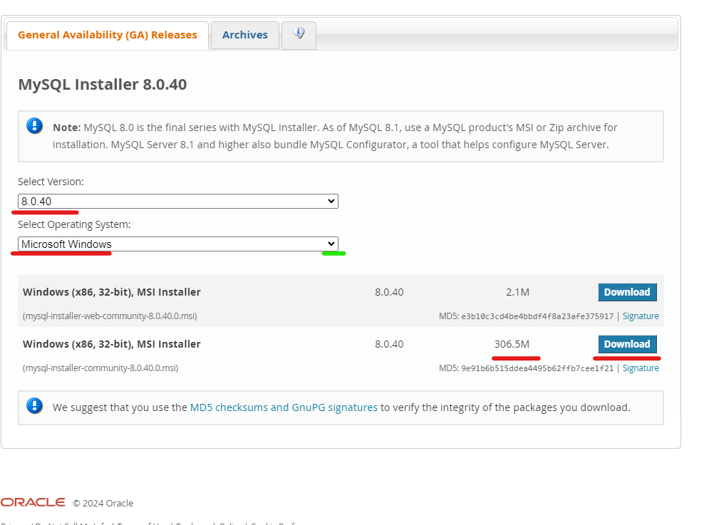
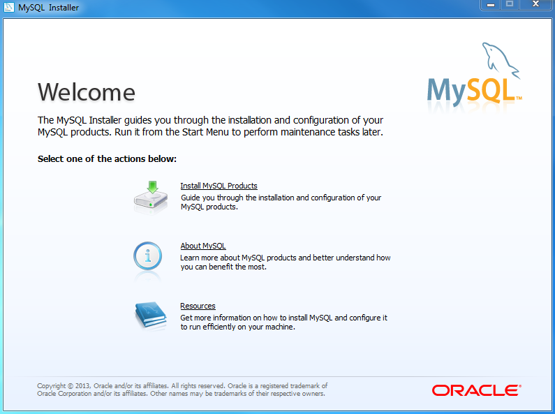
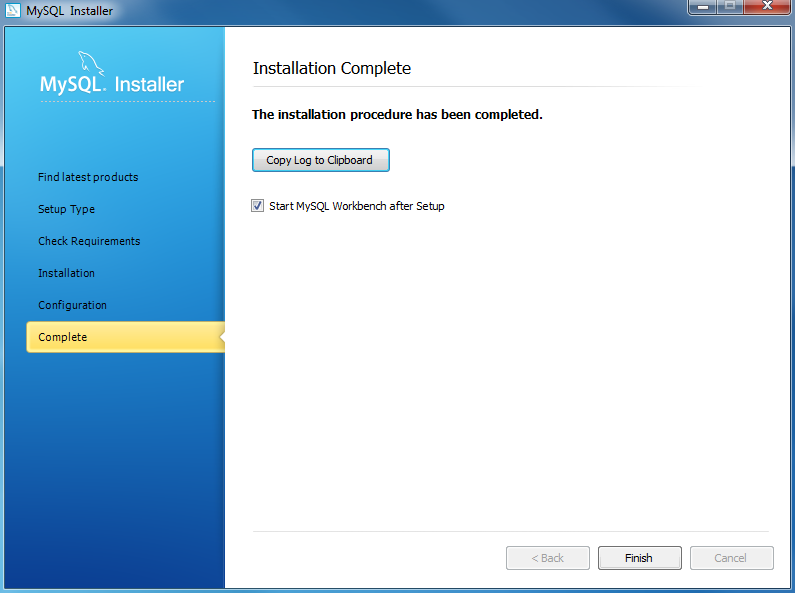

# 
 Manual de Instalação do GSW

## Requisitos Mínimos

- Java 11 ou mais recente
- Git
- Visual Studio Code

### Sistemas Operacionais Suportados

**Windows**
- Windows 10 ou mais recente

**Linux**
- Ubuntu/Debian 18.04 ou mais recente

**Mac**
- MacOS 10.14 ou mais recente

### Espaço Livre no HD ou SSD

- Mínimo de 2,7 GB de espaço livre

## Instalação do Git

### Windows/Linux/Mac

### 1. Acesse o link correspondente ao seu sistema operacional:  

- [Windows](https://git-scm.com/download/win)
- [Linux](https://git-scm.com/download/linux)
- [Mac](https://git-scm.com/download/mac)

### 2. Selecione a versão Standalone Installer, escolhendo entre 64 bits ou 32 bits conforme a arquitetura do seu computador:  

- **Windows:** Abra o prompt de comando e digite `systeminfo`
- **Linux:** Abra o terminal e digite `uname -m`
- **Mac:** Abra o terminal e digite `uname -m`

### 3. Clique em Download e siga as instruções de instalação.  

   

## Instalação do Visual Studio Code

### 1. Acesse o site do [Visual Studio Code](https://code.visualstudio.com/) e baixe a versão correspondente ao seu sistema operacional.  

### 2. Siga as instruções de instalação.

## Clonando o Repositório do Projeto GSW_API

### 1. Abra o Visual Studio Code.  

### 2. Clique em "Clone Repository" e cole o link do repositório:  

- https://github.com/FatecCoderHood/GSW_API.git  

## Instalação do Node.js

### 1. Baixe e instale o Node.js pelo site: [Node.js Download](https://nodejs.org/pt/download/)  

### 2. Aceite a licença de instalação.  

## Instalação do Java

### 1. Baixe e instale o Java pelo site: [Java Download](https://www.java.com/pt_BR/download/)  

### 2. Aceite a licença de instalação e clique em "Next".  

## Configuração de Variáveis de Ambiente  

### 1. Abra o Menu Iniciar e procure por "variáveis de ambiente".  
  

### 2. Clique em "Editar as variáveis de ambiente do sistema".  

  

### 3. Em “Variáveis do sistema”, selecione Path e adicione o caminho para a pasta `bin` dentro da instalação do Java 
(exemplo: C:\Program Files\Java\jdk-xx.x.x_xx\bin).  

  

### 4. Clique em ok e aplique a alteração.  

## Instalação do MySQL

### 1. Baixe e instale o MySQL pelo site: [MySQL Download](https://dev.mysql.com/downloads/installer/)  

### 2. Escolha a versão correta para o seu sistema operacional e siga as instruções de instalação.  

### 3. Crie um usuário e senha para o MySQL:  

- **Usuário:** root
- **Senha:** root
  
    ## Alterando a Senha no Projeto
   
Se você já possui um usuário e uma senha personalizados configurados no seu banco de dados, será necessário atualizar a senha diretamente no projeto. Siga os passos abaixo:  
- Navegue até o arquivo de configuração, localizado no seguinte caminho:
  C:\Users\aline\Documents\FATEC-3-BD\GSW_API\back\gsw-api\src\main\resources\application-dev.properties
- Localize a linha que contém as informações do banco de dados, semelhante à imagem abaixo:
  

  

- Atualize o valor da senha (e o usuário, caso necessário), respeitando o formato e a estrutura existente no arquivo.
- Salve o arquivo e feche o editor.

### 4. Clique em "Next" e finalize a instalação.  

## Próxima Etapa

Instalação finalizada.  
**Próxima etapa:** [Clique aqui para ir à próxima etapa](https://github.com/FatecCoderHood/GSW_API/blob/manual-criacao/documentacao/Manual/manual-rodar-programa.md)

