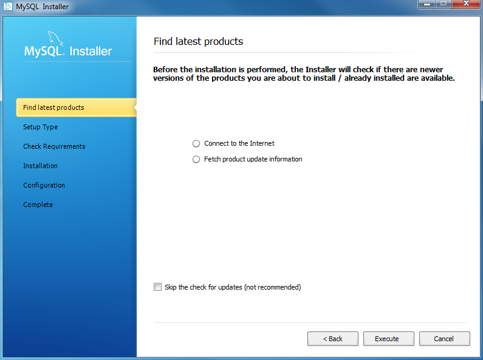
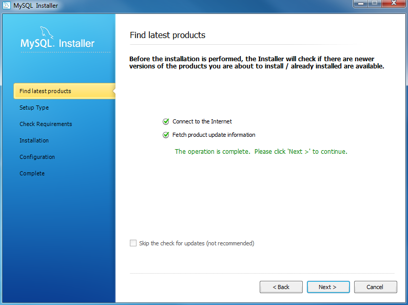
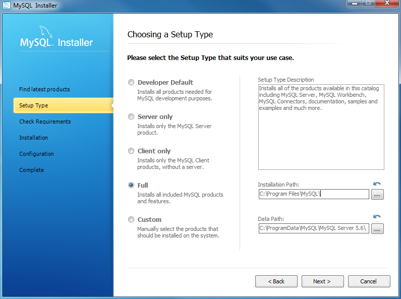
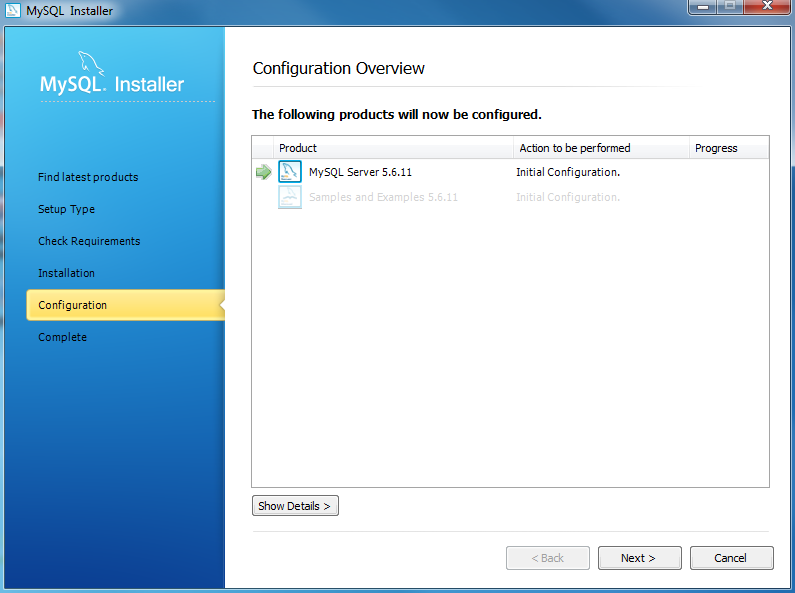
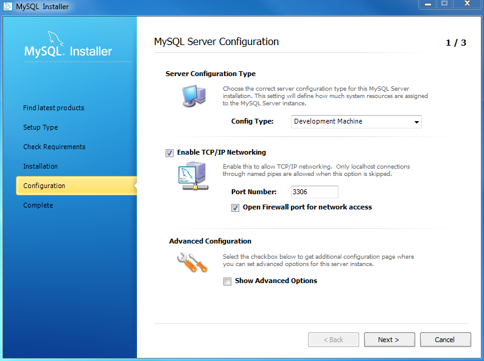
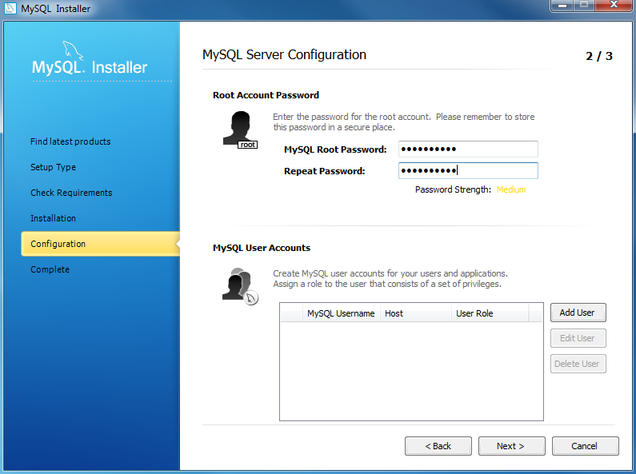

#### O PRIMEIRO PASSO PARA RODAR O PROGRAMA GSW ESTÁ AQUI: [CLIQUE AQUI](manual.md)

# Para utilizar o programa GSW é necessario seguir algumas etapas de instalação.
## REQUERIMENTOS MINIMOS
- Java 11 ou mais recente
- Git
- Visual Studio Code

SISTEMAS OPERACIONAIS

WINDOWS
- Windows 10 ou mais recente

LINUX
- Ubuntu/Debian 18.04 ou mais recente

MAC
- MacOS 10.14 ou mais recente  

MINÍMO DE ESPAÇO LIVRE NO HD OU SSD

- 2,7 GIGAS DE ESPACO LIVRE NO DISCO RÍGIDO OU SSD

## Instalação do GIT 

### Windows/Linux/Mac

1. Acesse esse link caso seu sistema operacional seja Windows: https://git-scm.com/download/win

1.1 Acesse esse link caso seu sistema operacional seja Linux: https://git-scm.com/download/linux

1.01 Acesse esse link caso seu sistema operacional seja Mac: https://git-scm.com/download/mac

1.3 Selicione a versão Standalone Installer, e escolha a versão 64 bits ou 32 bits, dependendo do seu computador.

1.4 Para descobrir a arquitetura do seu computador, 64 bits ou 32 bits, faça o seguinte comando:
- Windows: Abra o prompt de comando e digite: systeminfo
- Linux: Abra o prompt de comando e digite: uname -m
- Mac: Abra o prompt de comando e digite: uname -m

2. Após acessar o link com o sistema operacional correto, clique em Download

4. Clique em Download
5. Instale o GIT

## Instalação da IDE - VSCODE
6.Instale uma IDE, de preferencia o Visual Studio Code, em seu computador.

6.1 Para instalar o Visual Studio Code acesse:
-CLIQUE NO SIMBOLO DESTACADO NO CAMPO DE SEARCH BASEADO NA IMAGEM ABAIXO, SEGUINDO POR SEU SISTEMA OPERACIONAL

6.2 Clique em aceitar download

7.Clonar o repositório do projeto GSW_API

8.Abra o Visual Studio Code

8.1 Clique em clone ou clone a pasta do repositório

8.2 Copie o link do repositório : https://github.com/FatecCoderHood/GSW_API.git

8.3 Cole esse link no campo de clone

9. INSTALANDO NODE JS

10. Instale o Node JS pelo site: https://nodejs.org/pt/download/

11.Aceite a licença de intalação do Node JS

12.INTALAR JAVA SEM ADICIONAR AO PATH

13. Instale o JAVA pelo site: https://www.java.com/pt_BR/download/

13.1 Aceite a licença de intalação do Java e clique em "next":

### Configuração de Variáveis de Ambiente necessário de ambiente:

- Abra o Menu Iniciar, procure por "variáveis de ambiente".
- Clique em "Editar as variáveis de ambiente do sistema".
- Em “Variáveis do sistema”, selecione Path e adicione o caminho para a pasta bin dentro da instalação do Java (exemplo: C:\Program Files\Java\jdk-xx.x.x_xx\bin).

## 14. INSTALANDO MYSQL

14.1 Instale o MYSQL pelo site: https://dev.mysql.com/downloads/installer/

14.2 Escolha a versão correta para o seu sistema operacional

14.3 ESCOLHA A SEGUNDA OPÇÃO DE DOWNLOAD

15.1 Escolha a opção de instalação padrão

## 16. Configurar MYSQL

16.1 Clique em install mysql products

17.SIGA CLICANDO NO BOTÃO NEXT

17.1 CRIE UM USUÁRIO E SENHA PARA O MYSQL

17.01 USARIO: root

17.001 SENHA: root

18. Clique em NEXT 

20. Clique no quadrado vazio e em FINISH

## **INSTALAÇÃO FINALIZADA, PRÓXIMA ETAPA:** [**CLIQUE AQUI PARA IR A PRÓXIMA ETAPA**](manual-rodar-programa)

